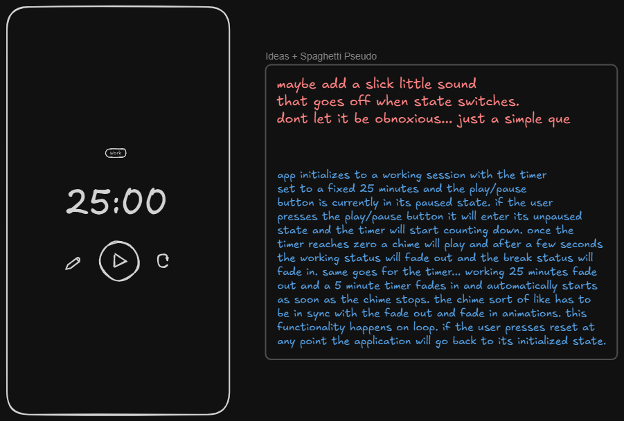

<h1 align="left">Time-25</h1>

###

<p align="left"><b>Time-25</b> is a <i>neo-minimal</i> Pomodoro timer built entirely with HTML, CSS, and JavaScript. It's designed as a fully sealed module since everything from the timer display to the session editor, play/pause, and reset logic lives inside one class: <code>Timer</code></p>

###

<p align="left">The result is a pure, modular timer system that can be dropped into any other project without rewriting or restructuring. It's as much an exercise in clean code architecture as it is a productivity tool.</p>

###

<h2 align="left">Architecture & Design Philosophy</h2>

###

<p align="left">Time-25 is built as a <b>fully encapsulated component</b> — a self contained class that manages its own state, logic, and user interface without exposing any external methods or global dependencies.</p>

###

<p align="left">All behavior, from DOM interactions to timing logic and event binding, is managed internally through private fields and methods. Instantiating the <code>Timer</code> class initializes everything automatically, allowing it to function as a drop-in timer module with zero configuration overhead.</p>

###

<p align="left">The design philosophy emphasizes <i>clarity</i> through <i>containment</i>: every moving part lives inside the class ensuring no leaks, no side effects, and no collisions with the global scope. The result is a clean architectual boundary — a true black box that performs its role silently and efficiently within any host project.</p>

###

<h2 align="left">Features</h2>

###

- Start, pause, and reset functionality
- Automatic switching between work and break sessions
- Custom session durations saved with <code>localStorage</code>
- Modal-based editing interface for easy customization
- Fully encapsulated state and behavior — no globals
- Subtle, minimal visual animation design
- Drop-in architecture ready for integration in other apps

###

<h2 align="left">Technologies</h2>

###

<div align="left">
  
  
  
  
  
  
  
</div>

###

<h2 align="left">Usage Example</h2>

###

<p align="left">All the HTML inside <code>index.html</code> is required for the component to be fully functional.</p>

###

```js
import Timer from "./app.js";

document.addEventListener("DOMContentLoaded", () => {
  new Timer();
});
```

###

<p align="left">That's it. No framework dependencies, no setup scripts, no nonsense. Just instantiate and the component takes care of everything else.</p>

###

<h2 align="left">Design Overview</h2>

###

<p align="left">Time-25's visual identity is deliberately restrained. The dark, soft-industrial color palette is accented by gentle glows and motion — animations that respond to state changes rather than run endlessly. The badge and timer animations are subtle but distinct, designed to convey energy without distraction.</p>

###

<h2 align="left">Mockup</h2>

###

<div align="left">
  
</div>

###
